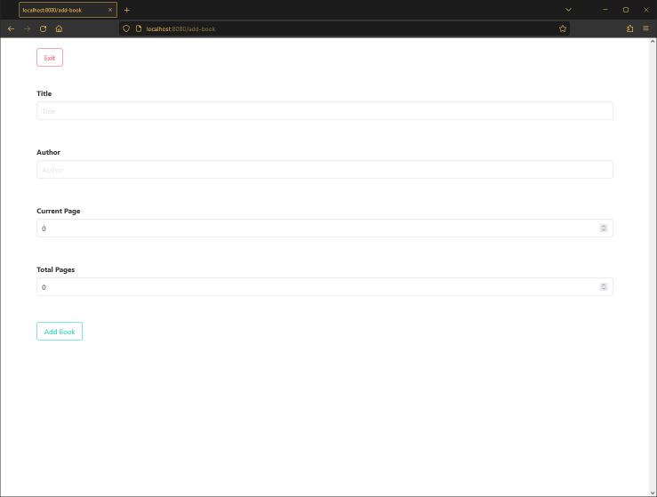

# Booklist

> Java app with MongoDB for your book list with configured Docker Compose.

## Preview




## How to run

* ### Docker

1. Build with Gradle.

    ```
    gradle build
    ```

2. Run Docker Compose.

    ```
    docker compose up -d
    ```

* ### No Docker (Local MongoDB Server Required)

1. Change first line of *application.properties*.

    ```
    spring.data.mongodb.host=localhost 
    ```
   
2. Run with Gradle.

    ```
    gradle bootRun
    ```